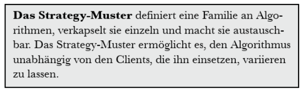

# Week 2 - Strategy Muster

## How can we separate the code into the changeable and the unchangeable

We create two (from Duck.java independent) interfaces for _FlyBehavior_ and for _QuackingBehavior_

## Questions

### Page 5

Welche der folgenden Punkte sind Nachteile beim Einsatz von Vererbung, um das Verhalten
der Enten zu implementieren?

- [x] A
- [ ] B (is true too!)
- [ ] C
- [x] D
- [ ] E
- [x] F

### Page 8

Welche Gründe kann es geben, dass Sie den Code ändern müssen?

- New Models needed that can cause redundant Code.
- A new version of the coding language that doesn't support older ones anymore.

